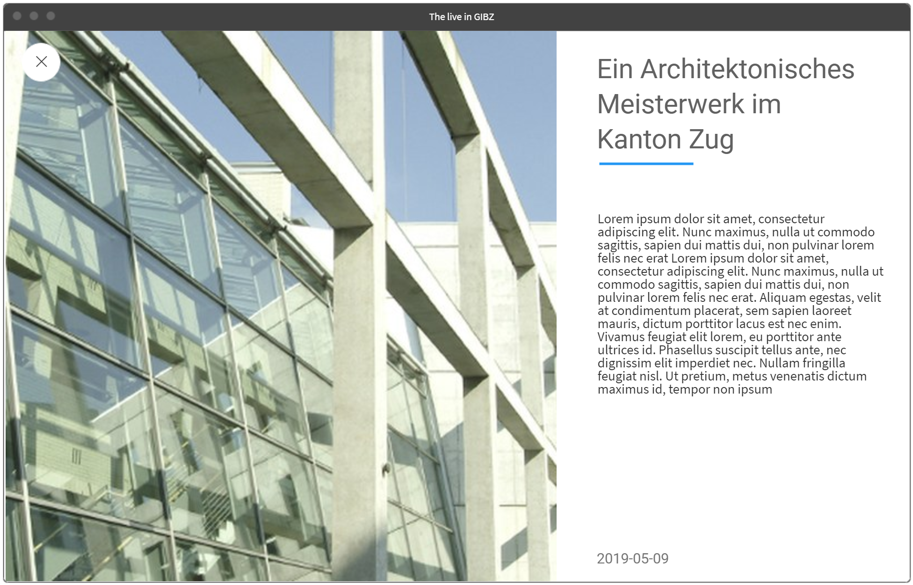

Storyboard
==========

Thema
-----
The live in GIBZ, ist ein Blog über das Leben am GIBZ. Die Seite wird selbst gemachte Fotos, Videos und Audioausschnitte am und vom GIBZ mit kurzen Beschreibungen enthalten.
Durch die Wahl dieses Themas sind wir in der Lage den grössten Teil unserer Inhalte während dem regulären Schulunterricht zu erstellen. Zudem bietet der Blog gute Möglichkeiten sich künstlerisch auszuleben und etwas ästhetisches zu Erschaffen. Auch hat es den Vorteil, dass jeder das GIBZ kennt.

Inhalte
-------
### Quellen
Für die Quellen der präsentierten Bildern werden wir eine Mischung aus eigener Arbeit und Medien aus dem Internet nutzen. Die eigen Arbeit wird aus selbst geschossenen Bildern und Videos, sowie auch deren Bearbeitung, bestehen.
Auch möchten wir die Möglichkeit nutzten selbst Illustrationen zu gestallten und diese als Logo usw. einzusetzen.

### Aufbereitung
Die Medien werden anhand der Internetverbindung des Users aufbereitet. Falls im laufe des Projektes grosse Videos entstehen, werden wir diese via Stream zur Verfügung stellen.

### Videos
***Abmessungen***
- 2.160 Pixel: 3.840 x 2.160
- 1.080 Pixel: 1.920 x 1.080
- 720 Pixel: 1.280 x 720
- 480 Pixel: 854 x 480
- 360 Pixel: 640 x 360
- 240 Pixel: 426 x 240

***Formate***
Um die bestmögliche Abdekung der verschiedenen Browsern zu erhalten werden wir folgende Formate verwenden:
- MP4
- WebM

***Untertitel***
Damit unsere Videos auch ohne Ton geschaut werden können werden wir diese Untertitel verwenden:
- Deutsch
- Niederländisch

### Fotos
***Abmessungen***
Hoch, und Quer-kant
- Breite 3.840px
- Breite 1.920px
- Breite 1.280px
- Breite 854px
- Breite 640px
- Breite 426

***Formate***
- JPG: Für Bilder aus dem Leben
- SVG: Für Logos und Illustrationen
- GIF: Für Animationen

### Audio
***Formate***
Um die bestmögliche Abdeckung der verschiedenen Browsern zu erhalten werden wir folgende Formate verwenden:
- MP3
- WAV

Bibliotheken und Frameworks
---------------------------
| Name            | Beschreibung                                                                                                       |
| ----------------| ------------------------------------------------------------------------------------------------------------------ |
| MaterialDesign  | Design Framework welches Icons und Optische Vorlagen für unsere Website mitbringt.                                 |

Werkzeuge und Hilfsmittel
-------------------------

| Hilfsmittel | Beschreibung |
| ---| --- |
| Editor | Für die Entwicklung des Blogs wird jeder den Editor seiner Wahl verwenden. |
| Repository | Wir verwenden [Git](https://git-scm.com/) mit einem privaten [Github](https://github.com) Repository für die Resourcen Verwaltung. |
| Dokumentation | Dieses Storyboard und alle weiteren Dokumentationen werden mithilfe vom [Markdown](https://en.wikipedia.org/wiki/Markdown) erstellt um eine einfache, schnelle und universelle Formatierung zu erreichen. |
| Mockup | Die im Storyboard verwendeten Mockups wurden mit dem Online Tool [MockFlow](https://mockflow.com/) erstellt. |
| Bildbearbeitung | Mit [GIMP](https://www.gimp.org/) werden wir die Bearbeitung der Bilder vornehmen. |
| Illustrationen  | Mithilfe von [Inkscape](https://inkscape.org/) werden wir die benötigten Illustrationen erstellen. |
| Videobearbeitung | Die Videobearbeitungen werden wir mithilfe von [ffmpeg](https://ffmpeg.org/) durchführen |

Aufbau und Struktur
-------------------
Wir werden einen OnePager erstellen der Timeline mässig strukturiert ist. Neu Blog Beiträge werden demnach immer am Start angefügt. Blogbeiträge bestehen immer aus einem Textbeitrag und einem Bild, Video oder Audio Elemente.  

***Mockups***

Auf der Startseite sind alle Beitrage zeitlich untereinander angeordnet. Bei jedem Post ist das Bild, Video oder Audio Element ersichtlich und der dazugehörige Titel. Mit einem Klick auf den Beitrag kann man den dazu geposteten Text einsehen. Zudem ist zur besseren Orientierung Rechts eine Scrollbar mit den Upload Daten vorhanden.

Diese ist die erweiterte Ansicht eines Blog Beitrages. Hier wird dem Nutzer nicht nur das Medium und der Titel des Posts angezeigt, sondern auch noch der dazugehörige Text. Am unteren Rand sollte zudem das Upload Datum ersichtlich sein.

Beim scrollen wird der blaue Balken fortlaufen nach rechts erweitern.

Dies ist die Mobile Versio unseres Blogs.

Arbeitsplanung
--------------
| Woche | Arbeit |
| --- | --- |
| 17 Mai. | Arbeitspaket 20, 21 (Layout der Webseite) & 06 (Logo), 04 |
| 24 Mai. | Arbeitspaket 01, 02, 03 (Foto, Video, Audio) |
| 31 Mai. | Arbeitspaket 04, 05 (schneiden, editieren) & 07, 08, 11 |
| 07 Jun. | Arbeitspaket 09, 10 & 12, 13, 14 |
| 14 Jun. | Arbeitspaket 15, 16, 17, 19 |
| Abgabe | Feiern|

